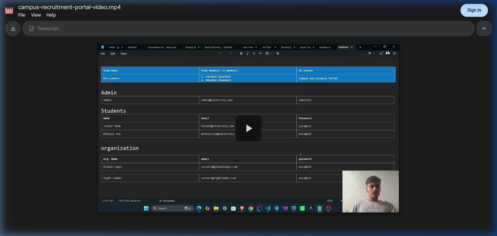
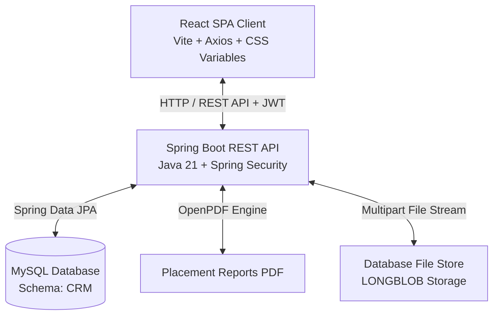
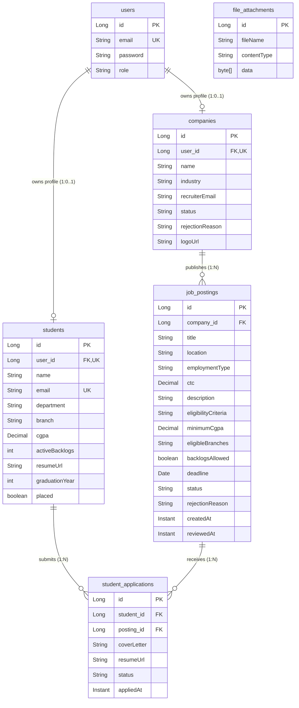
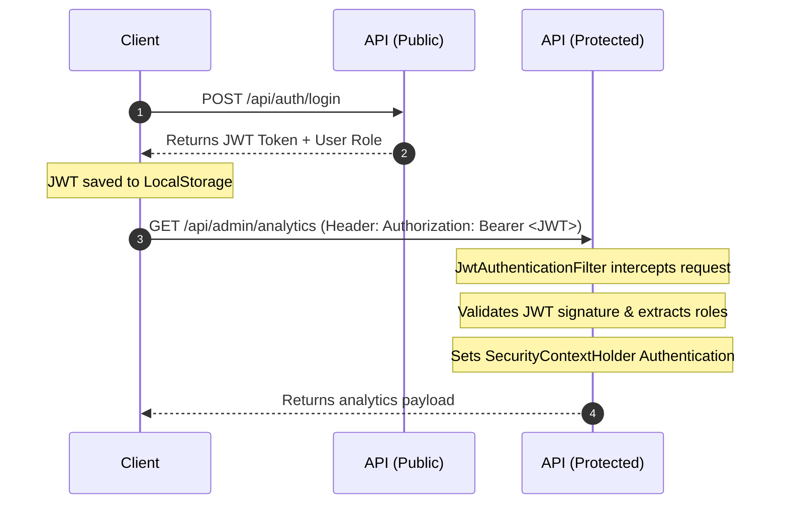

# Campus Recruiting Portal (CRP) - Master Manual & Technical Reference Guide

[](https://drive.google.com/file/d/1pZfu8G3xrySDFKOFGNVWgT60PBL_8UjR/view?usp=sharing)

> 🎥 **Walkthrough Video**: [Click here to watch the full project demonstration on Google Drive](https://drive.google.com/file/d/1pZfu8G3xrySDFKOFGNVWgT60PBL_8UjR/view?usp=sharing)

A secure, transactional web portal designed to coordinate university campus placement activities. This application establishes a unified workspace connecting **Students**, **Registered Companies**, and the **University Placement Cell (Admin)** to automate the recruitment pipeline—from company profile validation and job eligibility screening to bulk data imports and dynamic PDF analytics reporting.

---

## 🏗️ System Architecture & Layout

The portal is designed as a decoupled client-server architecture.



- **Frontend Client**: React Single Page Application built with Vite. It features a custom design system built with CSS variables (supporting dark-mode), stateful authentication management, Axios-intercepted network services, and role-based client routing.
- **Backend API**: Spring Boot 4.1 REST API that manages the business logic, enforces role-based endpoint access control via a custom JWT validation filter, and executes transactions against MySQL database entities.
- **Database Store**: MySQL database housing credential logs, applicant states, file attachments stored as database blobs, and statistical structures.

---

## 🛢️ Database Schema & Relational Model

The persistence layer uses a MySQL relational model mapped via JPA. Below is the Entity-Relationship (ER) diagram representing the schema:



### Table Metadata & Constraints
- **`users`**: Base credentials. `role` stores enums: `ADMIN`, `STUDENT`, `COMPANY`.
- **`students`**: Academic metrics. `cgpa` is constrained to `DECIMAL(3,2)`. `user_id` has a unique foreign key constraint linking to `users(id)`.
- **`companies`**: Status records (`PENDING`, `APPROVED`, `REJECTED`, `DEACTIVATED`).
- **`job_postings`**: Contains target specifications. Holds status tags (`PENDING`, `APPROVED`, `REJECTED`, `CLOSED`).
- **`student_applications`**: Junction table. A composite unique key constraint on `(student_id, posting_id)` restricts students to a single submission per posting.
- **`file_attachments`**: Stores resumes and logos directly inside the database as binary arrays mapped to a MySQL `LONGBLOB` column.

---

## 🔐 Authentication, Authorization, & Security

The system employs stateless JWT-based authentication. 



### Access Restrictions
- **Domain Restriction**: Students can register only if their email domain ends with `@university.edu`.
- **Company Screening**: Company accounts default to `PENDING` status. They cannot post jobs or view applications until an Administrator verifies their registration and switches their status to `APPROVED`.
- **Job Status Visibility**: Students can view only `APPROVED` and `CLOSED` postings. Pending review jobs are hidden. Companies can view only their own listings, while Admins have full read access to all postings.

---

## 💻 Crucial Methods & Implementation Walkthroughs

### 1. Backend Core Methods

#### 🔑 JWT Authentication Interception
* **Location**: [JwtAuthenticationFilter.java](file:///e:/campus-recruiting-portal/campus-recruiting-portal/backend/src/main/java/com/yourorg/crp/config/JwtAuthenticationFilter.java#L25-L46)
* **Code Reference**:
  ```java
  @Override
  protected void doFilterInternal(HttpServletRequest request, HttpServletResponse response, FilterChain filterChain)
          throws ServletException, IOException {
      String authHeader = request.getHeader("Authorization");
      if (authHeader == null || !authHeader.startsWith("Bearer ")) {
          filterChain.doFilter(request, response);
          return;
      }

      String token = authHeader.substring(7);
      if (jwtService.isTokenValid(token)) {
          String email = jwtService.extractEmail(token);
          String role = jwtService.extractRole(token);
          if (email != null && role != null && SecurityContextHolder.getContext().getAuthentication() == null) {
              String normalizedRole = role.toUpperCase();
              UsernamePasswordAuthenticationToken authToken = new UsernamePasswordAuthenticationToken(
                      email, null, List.of(new SimpleGrantedAuthority("ROLE_" + normalizedRole)));
              SecurityContextHolder.getContext().setAuthentication(authToken);
          }
      }
      filterChain.doFilter(request, response);
  }
  ```
* **How it works**: The filter runs once per HTTP request. It parses the incoming `Authorization` header. If a valid JWT is present, it extracts the principal email and role payload, constructs an authentication token prepended with `ROLE_`, and sets Spring Security's thread-local `SecurityContextHolder`.

#### 📂 Transactional CSV Import
* **Location**: [StudentService.java](file:///e:/campus-recruiting-portal/campus-recruiting-portal/backend/src/main/java/com/yourorg/crp/service/StudentService.java#L62-L112)
* **How it works**: The `importStudentsFromCsv` method is wrapped in a `@Transactional` block. It reads a multipart CSV stream line-by-line using a `BufferedReader`, splits fields, validates constraints (e.g., skips non-university email domain names or pre-existing duplicate entries), encrypts credentials using `PasswordEncoder`, saves a parent `User` record, and instantiates the associated child `Student` profile entity.

#### 📊 Dynamic PDF Document Stream
* **Location**: [ReportService.java](file:///e:/campus-recruiting-portal/campus-recruiting-portal/backend/src/main/java/com/yourorg/crp/service/ReportService.java#L28-L138)
* **How it works**: Uses the **OpenPDF** engine to generate placement cell statistics on the fly. It aggregates data inside `AnalyticsService`, creates a memory-backed PDF `Document`, writes stylized headings, sets up cell structures, feeds branch placement tables, and compiles the stream directly to an HTTP servlet response.

---

### 2. Frontend Core Methods

#### 🛰️ Axios Client Request & Response Interceptors
* **Location**: [services/api.js](file:///e:/campus-recruiting-portal/campus-recruiting-portal/frontend/src/services/api.js)
* **Code Reference**:
  ```javascript
  api.interceptors.request.use(
    (config) => {
      const token = localStorage.getItem('token');
      if (token) {
        config.headers.Authorization = `Bearer ${token}`;
      }
      return config;
    },
    (error) => Promise.reject(error)
  );

  api.interceptors.response.use(
    (response) => response,
    (error) => {
      if (error.response && error.response.status === 401) {
        localStorage.removeItem('token');
        localStorage.removeItem('user');
        window.dispatchEvent(new Event('auth-change'));
      }
      return Promise.reject(error);
    }
  );
  ```
* **How it works**:
  - **Request Interceptor**: intercepts all API calls, fetches the active JWT from `localStorage`, and appends it to the header.
  - **Response Interceptor**: traps responses. If the backend returns a `401 Unauthorized` (indicating the JWT has expired), the interceptor immediately clears user credentials from local storage and dispatches a global window event to trigger redirect workflows.

#### 🛡️ Protected Navigation Guard
* **Location**: [components/RouteGuard.jsx](file:///e:/campus-recruiting-portal/campus-recruiting-portal/frontend/src/components/RouteGuard.jsx)
* **How it works**: The `RouteGuard` component intercepts React Router navigation hooks. It inspects the globally shared `AuthContext` to determine if a user session is active. If the user is unauthenticated or has a role that is not listed in the component's `allowedRoles` array, it forces a redirect to the login screen.

---

## 🛠️ User & Stakeholder Operating Manual

### 🎓 For Students
1. **Account Registration**: Sign up using your official email ending with `@university.edu`.
2. **Setup Profile**: Navigate to `/student/profile`. Enter academic details (CGPA, Branch, backlogs count) and upload your resume.
3. **Job Search**: Navigate to `/student/jobs`. View all approved job listings. The system automatically highlights whether you meet the company's eligibility criteria (CGPA threshold, target branch, and backlog limits).
4. **Submitting Applications**: Select an eligible job listing, draft your cover letter, and submit your application.
5. **Real-time Status Tracking**: View `/student/applications` to monitor whether your application is `APPLIED`, `SHORTLISTED`, `INTERVIEWING`, or `SELECTED`.

### 🏢 For Recruiters / Companies
1. **Company Onboarding**: Register your corporate profile. Your status remains `PENDING` until approved by the Placement Cell Admin.
2. **Posting Job Vacancies**: Navigate to `/company/post-job`. Enter the role description, CTC details, eligibility thresholds (CGPA, allowed branches, backlog toleration), and application deadline.
3. **Applicant Selection Board**: Open the dashboard to track applicants. Select a job posting to view list profiles, download candidate resumes, and update applicant states.

### 🛡️ For University Placement Cell (Admin)
1. **Recruitment Analytics**: Access `/admin/analytics` to view placement rates, branch charts, and export PDF placement reports.
2. **Company Registration Auditing**: Navigate to `/admin/companies` to approve pending registrations or provide rejection remarks.
3. **Job Posting Approvals**: Review submitted company postings at `/admin/jobs/pending` to verify descriptions and parameters before they go live.
4. **Data Management**: Use `/admin/students` to bulk-import student records via CSV files, toggle placement switches, or download spreadsheet logs.

---

## ⚡ Setup & Runbook

### Step 1: Initialize the Database & Backend REST API
1. Create a MySQL database named `CRM`.
2. Update database login credentials inside the backend resource properties file: [application.properties](file:///e:/campus-recruiting-portal/campus-recruiting-portal/backend/src/main/resources/application.properties).
3. Run the Spring Boot server using the Maven wrapper:
   ```powershell
   cd backend
   .\mvnw.cmd clean spring-boot:run
   ```
   The backend API starts running on port `8080` (`http://localhost:8080`).
   - **Interactive API Documentation**: Explore the endpoints via Swagger UI at `http://localhost:8080/swagger-ui/index.html`.

### Step 2: Initialize the Frontend React SPA
1. Open a new terminal console.
2. Install npm packages and launch Vite's local dev server:
   ```bash
   cd frontend
   npm install
   npm run dev
   ```
   The web application launches on `http://localhost:5173`.

### 🔑 Developer Login Credentials (Pre-Seeded)
On startup, a seeding utility seeds mock accounts to streamline local development testing:
- **Placement Cell (Admin)**: `admin@university.edu` / `admin123`
- **Approved Recruiter (Orbit)**: `recruiting@orbit.example` / `password123`
- **Eligible Student (Priya)**: `priya.mehta@university.edu` / `password123` (CGPA: 8.72, CSE, 0 backlogs)

---

## 📂 Sub-Module Directories
For additional configuration particulars, API specifications, and frontend component maps:
- 📘 [Backend Service Handbook](file:///e:/campus-recruiting-portal/campus-recruiting-portal/backend/README.md)
- 📙 [Frontend Client Handbook](file:///e:/campus-recruiting-portal/campus-recruiting-portal/frontend/README.md)
