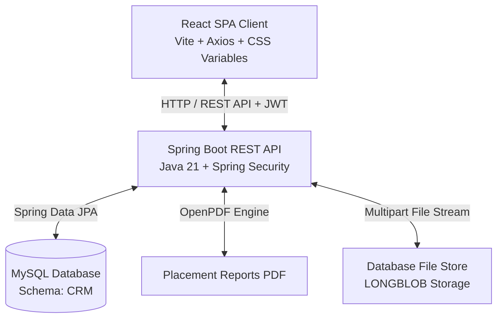
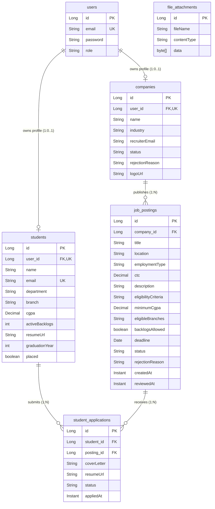
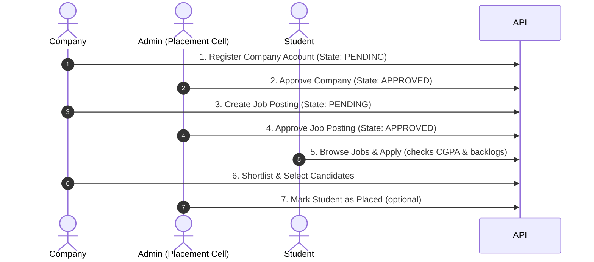

# Campus Recruiting Portal (CRP)

A secure, role-based web application designed to manage university campus placements. The system features three dedicated workspaces—**Student**, **Company**, and **Admin (Placement Cell)**—enabling automated recruitment workflows, candidate tracking, bulk data management, and placement report generation.

---

## 🏗️ System Architecture

The application is structured as a decoupled client-server architecture:



- **Frontend SPA**: React client built with Vite, utilizing React Router DOM for route protection and vanilla CSS design variables for light/dark theme switches.
- **Backend REST API**: Spring Boot server enforcing role-based security via custom JWT filters and handling transactional business logic.
- **Persistence Store**: MySQL relational database holding system configurations, student profiles, postings, applications, and binary uploads (resumes/logos).

---

## 🛢️ Database Schema & Relationships

The database is built on relational integrity constraints mapped via JPA. Below is the Entity-Relationship (ER) model of the schema:



### Table Dictionary & Constraints

1. **`users`**: Base credentials table. The `role` column holds enum values: `ADMIN`, `STUDENT`, or `COMPANY`.
2. **`students`**: Academic profile information. 
   - `user_id` acts as a unique Foreign Key to `users(id)`.
   - `cgpa` is constrained to `DECIMAL(3, 2)` (0.00 to 10.00 scale).
   - `placed` is a boolean flag tracking graduation status.
3. **`companies`**: Industry profile registrations.
   - Initial `status` is set to `PENDING`.
   - approved companies can create postings.
4. **`job_postings`**: Contains employment criteria.
   - `minimum_cgpa` is verified during application submission.
   - `status` controls student visibility (`PENDING`, `APPROVED`, `REJECTED`, `CLOSED`).
5. **`student_applications`**: Junction table mapping student applications to postings.
   - Composite Unique constraint on `(student_id, posting_id)` enforces a single application per job posting.
   - Candidate status transitions through: `APPLIED` ➔ `SHORTLISTED` ➔ `INTERVIEW` ➔ `SELECTED` / `REJECTED`.
6. **`file_attachments`**: System storage for resumes and logos. Stored using `LONGBLOB` binary format.

---

## 🔄 Core Workings & Recruiter Flow



1. **Self-Registration**: Companies register online. Their account status defaults to `PENDING` and they cannot publish vacancies.
2. **Placement Cell Audit**: Administrators verify company details and toggle status to `APPROVED`.
3. **Vacancy Posting**: Approved companies submit job postings. These are held in the `PENDING` pool.
4. **Eligibility Checks**: Once an Admin approves the posting, eligible students (whose profiles satisfy the minimum CGPA, match branch requirements, and check backlog flags) can apply.
5. **Interview Board & Selection**: The company views applicants, downloads resumes, and steps candidate statuses up to `SELECTED`.

---

## ⚡ Development Workspace Setup

### Prerequisites
- **Java**: JDK 21
- **Node.js**: v18 or newer
- **Database**: MySQL Server 8.x

---

### Step 1: Run the Backend Service

1. Create a MySQL database named `CRM` (or allow Spring Boot to auto-create it).
2. Configure credentials in [backend/.../application.properties](file:///e:/campus-recruiting-portal/campus-recruiting-portal/backend/src/main/resources/application.properties).
3. Compile and boot the Spring application:
   ```powershell
   cd backend
   .\mvnw.cmd clean spring-boot:run
   ```
   The backend API launches on `http://localhost:8080`.
   - **Interactive API Documentation**: Open `http://localhost:8080/swagger-ui/index.html` to explore the REST endpoints.

---

### Step 2: Run the Frontend Client

1. Open a new terminal instance.
2. Install client dependencies and launch the dev environment:
   ```bash
   cd frontend
   npm install
   npm run dev
   ```
   The application client starts at `http://localhost:5173`.

---

## 🔐 Default Access Accounts

The database seeds mock developer profiles on startup for rapid verification:

- **Placement Cell (Admin)**: `admin@university.edu` / `admin123`
- **Approved Company**: `recruiting@orbit.example` / `password123`
- **Eligible Student**: `priya.mehta@university.edu` / `password123` (GPA 8.72, 0 backlogs)

---

## 📂 Codebase Sub-Modules

For structural specifics, configurations, and API catalogs:
- 📖 [Backend REST API Handbook](file:///e:/campus-recruiting-portal/campus-recruiting-portal/backend/README.md)
- 📖 [Frontend React Client Handbook](file:///e:/campus-recruiting-portal/campus-recruiting-portal/frontend/README.md)
